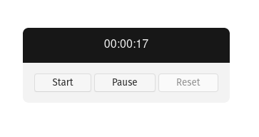

# Timer

## Desenvolvido com

- [Javascript][javascript]

## Referência

- [DAY 1 - How to code a timer in Javascript - #100DaysOfCode - Tyler Potts][reference]

## Screenshot

[javascript]: https://developer.mozilla.org/en-US/docs/Web/JavaScript
[reference]: https://www.youtube.com/watch?v=Kfr0XwW4g-o
